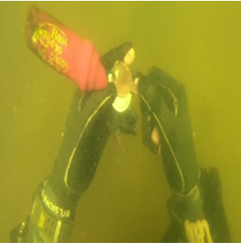

# URSCT-SESR: Reinforced Swin-Convs Transformer for Simultaneous Underwater Sensing Scene Image Enhancement and Super-resolution
[Tingdi Ren](http://www.adilifer.com/), Haiyongxu, Gangyi Jiang, Mei Yu, Xuan Zhang, Biao Wang, and Ting Luo.

---

This repository is the official PyTorch implementation of URSCT-SESR: Reinforced Swin-Convs Transformer for Simultaneous Underwater Sensing Scene Image Enhancement and Super-resolution

 

## Contents

1. [Training](#Training)
2. [Testing](#Testing)
3. [Download](#Download)
4. [Citation](#Citation)

## Training

### 1. Put your dataset into the folder "_data_" as follows:
_URSCT-SESR_ 
├─ other files and folders 
├─ _data_ 
│&ensp;&ensp;├─ _train\_data_ 
│&ensp;&ensp;│&ensp;&ensp;├─ _input_ 
│&ensp;&ensp;│&ensp;&ensp;&ensp;&ensp;&ensp;├─ _fig1.png_ 
│&ensp;&ensp;│&ensp;&ensp;&ensp;&ensp;&ensp;├─ ... 
│&ensp;&ensp;│&ensp;&ensp;├─ _target_ 
│&ensp;&ensp;│&ensp;&ensp;&ensp;&ensp;&ensp;├─ _fig1.png_ 
│&ensp;&ensp;│&ensp;&ensp;&ensp;&ensp;&ensp;├─ ... 
│&ensp;&ensp;├─ _val\_data_ 
│&ensp;&ensp;│&ensp;&ensp;&ensp;&ensp;&ensp;├─ ... 
│&ensp;&ensp;├─ _test\_data_ 
│&ensp;&ensp;│&ensp;&ensp;&ensp;&ensp;&ensp;├─ ...

### 2. Configure the _\*.yaml_:
If you want to train with the default setting, _\*\_DIR_ of _TRAINING_ and _TEST_ is the main option you need to edit.

(1) _Enh&SR\_opt.yaml_ for Simultaneous Underwater Sensing Scene Image Enhancement and Super-resolution

(2) _Enh\_opt.yaml_ for Underwater Sensing Scene Image Enhancement only

### 3. Run _\*\_train.py_

## Testing

### 1. As reported above, put your dataset for testing and model we provided into the folders as follows:
_URSCT-SESR_ 
├─ other files and folders 
├─ _checkpoints_ 
│&ensp;&ensp;├─ _model\_test_ (same as configurated above) 
│&ensp;&ensp;│&ensp;&ensp;├─ _models_ 
│&ensp;&ensp;│&ensp;&ensp;&ensp;&ensp;&ensp;├─ _model\_bestSSIM.pth_ (downloaded model) 
├─ _data_ 
│&ensp;&ensp;├─ _train\_data_ 
│&ensp;&ensp;├─ _val\_data_ 
│&ensp;&ensp;├─ _test\_data_ 
│&ensp;&ensp;│&ensp;&ensp;├─ _input_ 
│&ensp;&ensp;│&ensp;&ensp;&ensp;&ensp;&ensp;├─ _fig1.png_ 
│&ensp;&ensp;│&ensp;&ensp;&ensp;&ensp;&ensp;├─ ... 
│&ensp;&ensp;│&ensp;&ensp;├─ _target_ 
│&ensp;&ensp;│&ensp;&ensp;&ensp;&ensp;&ensp;├─ _fig1.png_ 
│&ensp;&ensp;│&ensp;&ensp;&ensp;&ensp;&ensp;├─ ... 

### 2. Run _\*\_eval.py_

## Download
### Model
(1) [GoogleDrive](https://drive.google.com/drive/folders/1ljhYcXwbdJ0fYzlF9UbEbZwr5zKk1ERb?usp=sharing)

(2) [BaiduDisk](https://pan.baidu.com/s/1SSwjv37uvwR7Zilq0s3YHw) (Password: SESR)

### Dataset
(1) LSUI (UIE): [Data](https://lintaopeng.github.io/_pages/UIE%20Project%20Page.html) [Paper](https://arxiv.org/abs/2111.11843) [Homepage](https://lintaopeng.github.io/_pages/UIE%20Project%20Page.html)

(2) UIEB (UIE):  [Data](https://li-chongyi.github.io/proj_benchmark.html) [Paper](https://ieeexplore.ieee.org/document/8917818) [Homepage](https://li-chongyi.github.io/proj_benchmark.html)

(3) SQUID (UIE): [Data](http://csms.haifa.ac.il/profiles/tTreibitz/datasets/ambient_forwardlooking/index.html) [Paper](https://ieeexplore.ieee.org/abstract/document/9020130) [Homepage](http://csms.haifa.ac.il/profiles/tTreibitz/datasets/ambient_forwardlooking/index.html)

(4) UFO (SESR): [Data](https://irvlab.cs.umn.edu/resources/ufo-120-dataset) [Paper](https://arxiv.org/abs/2002.01155) [Homepage](https://irvlab.cs.umn.edu/projects/deep-sesr)

(5) USR (SR): [Data](https://irvlab.cs.umn.edu/resources/usr-248-dataset) [Paper](https://arxiv.org/abs/1909.09437) [Homepage](https://irvlab.cs.umn.edu/projects/srdrm)

## Citation
    @article{ren2022reinforced,
	  title={Reinforced Swin-convs Transformer for Simultaneous Underwater Sensing Scene Image Enhancement and Super-resolution},
	  author={Ren, Tingdi and Xu, Haiyong and Jiang, Gangyi and Yu, Mei and Zhang, Xuan and Wang, Biao and Luo, Ting},
	  journal={IEEE Transactions on Geoscience and Remote Sensing},
	  year={2022},
	  publisher={IEEE}
	}
